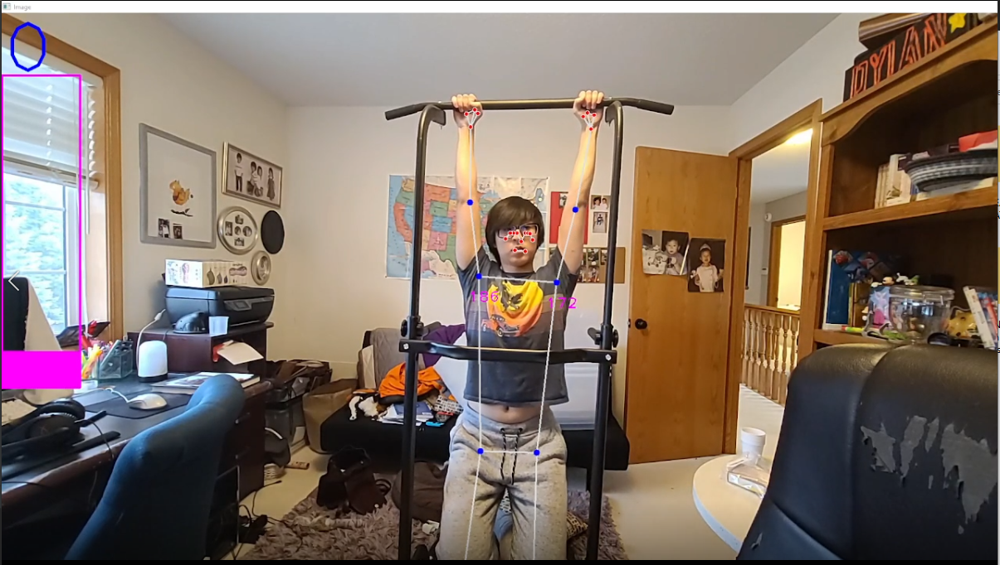
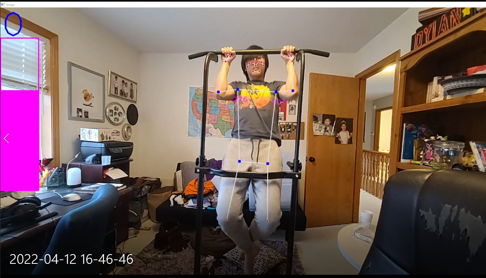
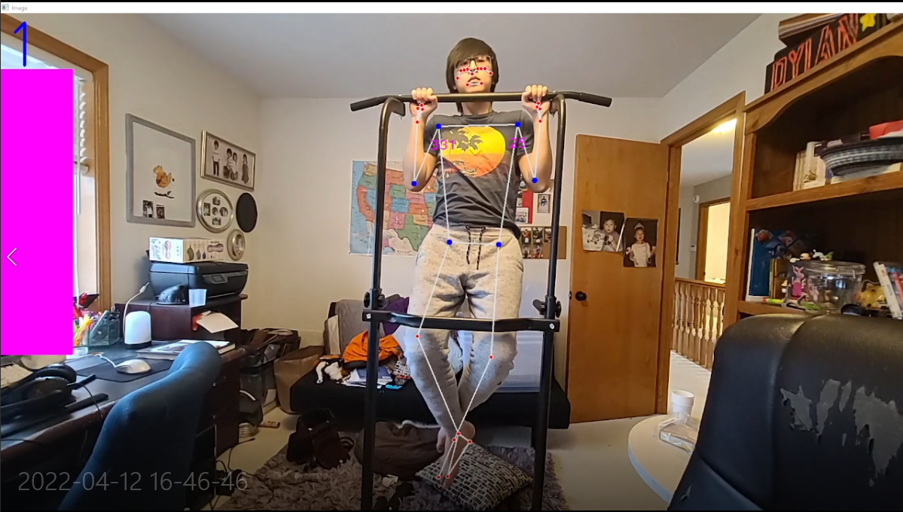

# Pullup Counter
Credits:https://www.computervision.zone/
## **Goals**
-Create a AI trainer using OpenCV and Mediapipe to detect when a person does a pull up
-Get the landmarks on the body to use for angles detection
# **Outcome**

